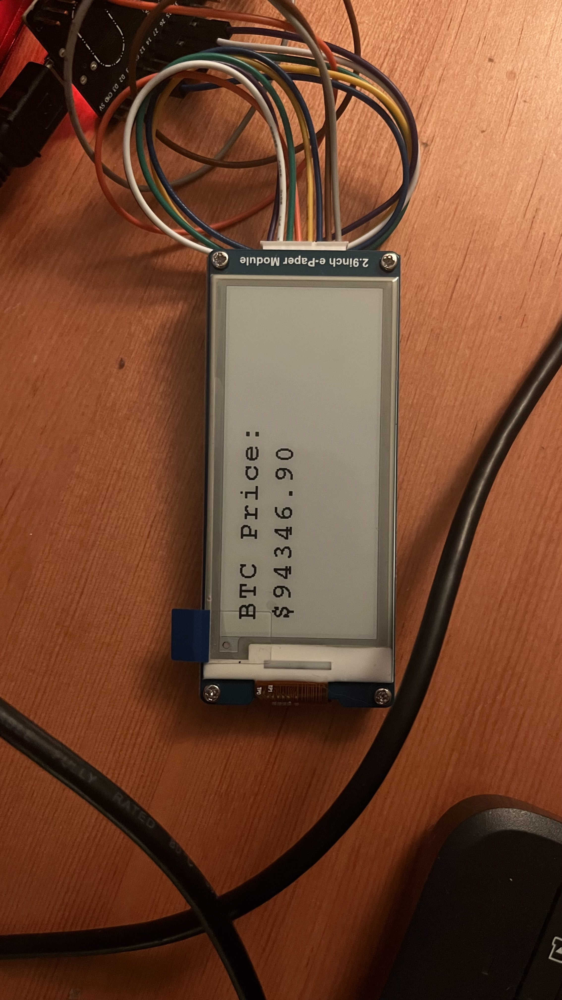

# Bitcoin Price Display on 2.9 inch e-Paper using ESP32

This project fetches the Bitcoin price from the internet using ESP32_DevKitc_V4 and displays it on a 2.9 inch e-Paper screen.


## Used Hardware

- **ESP32 DevKitC V4**
- **2.9 inch e-Paper Module Waveshare**

## Connection Pins

ESP32 ve e-Paper modülü arasındaki bağlantılar aşağıdaki gibidir:

## Libraries Used

- **WiFi.h**: Allows the ESP32 to connect to WiFi.
- **HTTPClient.h**: Enables making HTTP requests.
- **ArduinoJson.h**: Used for parsing JSON data.
- **DEV_Config.h**, **EPD.h**, **GUI_Paint.h**, **imagedata.h**: Necessary libraries for the Waveshare e-Paper module.

## Setup

1. Open **Arduino IDE** and add the following libraries:
   - [Waveshare e-Paper Library](https://www.waveshare.com/wiki/E-Paper_ESP32_Driver_Board)
   - WiFi
   - HTTPClient
   - ArduinoJson

2. Update your **WiFi credentials** and **API URL** in the code:
   ```cpp
   const char* ssid = "YOUR_SSID";
   const char* password = "YOUR_PASSWORD";
   const char* api_url = "https://api.coindesk.com/v1/bpi/currentprice/BTC.json";


```cpp
#define EPD_SCK_PIN  13 // DIN
#define EPD_MOSI_PIN 14 // CLK
#define EPD_CS_PIN   15
#define EPD_RST_PIN  26
#define EPD_DC_PIN   27
#define EPD_BUSY_PIN 25


